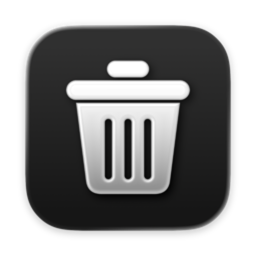

<div align="center">



# BetterCleaner

**The uninstaller macOS deserves.**

Complete uninstall · Native · Liquid Glass · Restorable cleanup · Free forever

[](https://github.com/rokartur/BetterCleaner/releases/latest)

<p>
  <a href="https://github.com/rokartur/BetterCleaner/releases/latest"></a>
  
  <a href="https://github.com/rokartur/BetterCleaner/releases"></a>
</p>

<sub>
  <a href="#install">Install</a> ·
  <a href="#features">Features</a> ·
  <a href="#build-from-source">Build</a> ·
  <a href="#contributing">Contribute</a>
</sub>

</div>

---

## Install

1. Download the latest `.dmg` from the [releases page](https://github.com/rokartur/BetterCleaner/releases/latest).
2. Open it and drag **BetterCleaner** into Applications.
3. Launch it. The app is signed with a Developer ID and notarized by Apple, so macOS trusts it out of the box.

> Requires macOS 13.0 or later.

## Features

- **Complete app uninstall.** Drag an app in (or pick it from the list) and BetterCleaner removes the app plus everything it left behind — support files, caches, preferences, saved state, logs, and login data — all behind a single confirmation.
- **Finds the leftovers other uninstallers miss.** Known macOS locations, installer receipts, bundle metadata, and Spotlight work together to find app-owned files. Ambiguous shared files stay unselected for review.
- **Reclaim wasted space.** Spot orphaned files from apps you already deleted, clear out junk caches and logs, and clean up developer leftovers.
- **Restorable file cleanup.** Files BetterCleaner removes directly go to a safe, restorable location. Delete History lets you search, reveal, and restore them; Homebrew and package-manager removals follow those tools' semantics, may be irreversible, and are logged rather than restorable.
- **Right from Finder.** Clean or uninstall straight from the Finder right-click menu.
- **Manage Homebrew.** Browse installed formulae & casks, upgrade or uninstall them (casks with a full *zap* that removes every leftover), control services and taps, search & install new packages, import/export a Brewfile, reclaim space with cleanup and autoremove, and adopt apps you installed by hand — all without the Terminal. Brew always runs as your user; if a cask's installer itself needs administrator rights, macOS asks for your password in a standard dialog.
- **Clean, native design.** A modern Mac interface with a sidebar app list and drag-and-drop to uninstall.
- **Your rules.** Grant permissions, exclude folders you want left alone, and set your own cleanup conditions.
- **Stays up to date.** Built-in automatic updates.

## Privacy

No telemetry. No analytics. No account. BetterCleaner runs entirely on your Mac and only asks for permission when a cleanup needs it — with no hidden background helper left running.

## Build from source

**Requirements:** macOS 13.0+, Xcode 16 or later.

```bash
git clone https://github.com/rokartur/BetterCleaner.git
cd BetterCleaner
open BetterCleaner.xcodeproj
```

Build and run the **BetterCleaner** scheme (⌘R). Swift Package dependencies resolve automatically.

To produce a signed, notarized release build:

```bash
scripts/build_release.sh --auto-release --notes "$(cat log.md)"
```

## Contributing

Issues and pull requests are welcome. For larger changes, open an issue first to discuss what you'd like to change.

## License

© 2026 Artur Rok. All rights reserved.
